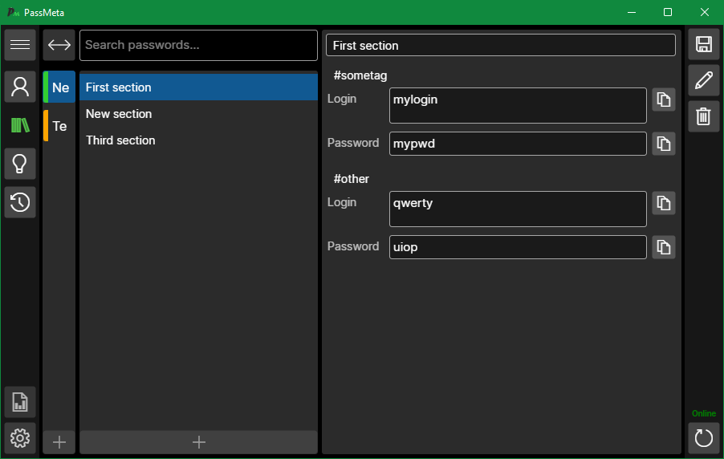

# PassMeta Desktop App
#### © 2022 Vladislav Mironov

### About the project
PassMeta DesktopApp is a cross-platform client application of PassMeta System for Windows, Linux and macOS.
 
Currently under development.

### Technologies
*.NET 5.0, C#, Avalonia UI.*