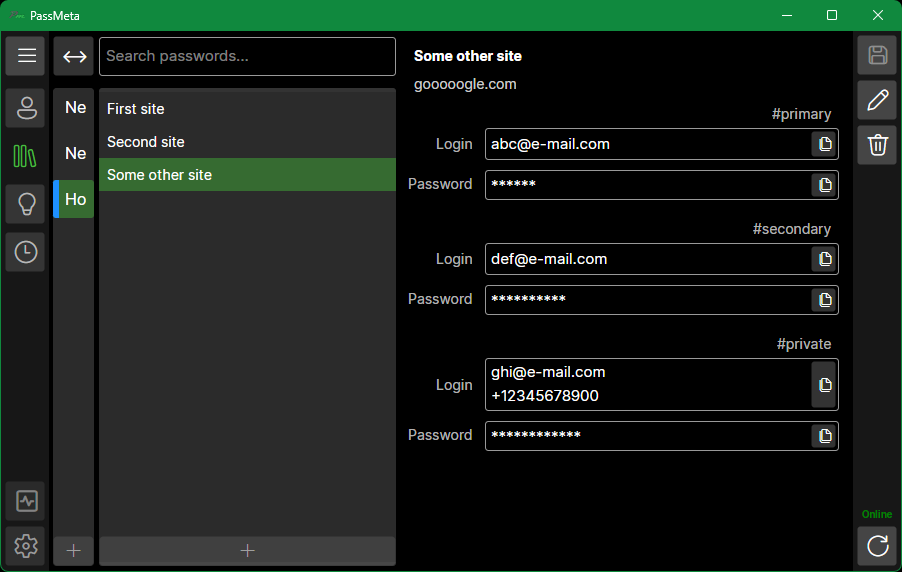

# PassMeta Desktop App
#### © 2023 Vladislav Mironov

### About the project
PassMeta DesktopApp is a cross-platform client application of PassMeta System for Windows, Linux and macOS.

### Technologies
*.NET 6.0, C#, Avalonia UI.*

### Screenshots

 
 

