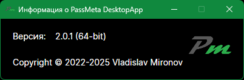

# PassMeta Desktop App — *your passwords SAFE*
#### © 2023 Vladislav Mironov

### About the project
PassMeta DesktopApp is a cross-platform client application of PassMeta System for Windows, Linux and macOS.

**Server** application is [here](https://github.com/defhid/PassMeta-Server).

### Technologies
_.NET 6.0, C#, Avalonia UI_
 
_MVVM, Reactive UI, Service Locator, AutoMapper_
 
_AES256 multipass (client side only), SHA256_

### Screenshots

#### _General password storage page:_

#### _General password storage page, editing:_

#### _Password file info:_

#### _Random password generator page:_

#### _User account page:_

#### _Server side journal page:_

#### _Client side logs page:_

#### _Application settings page:_

#### _Application info:_
